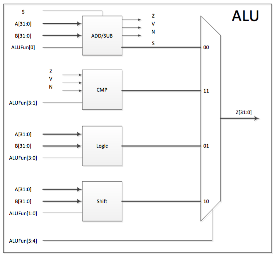

## ALU

### 模块设计

我们采用实验指导书上的设计，如下图所示：



故我们分别实现 `adder`, `comparer`, `logicer` 和 `shifter` 四个子模块，然后在 `alu` 顶层模块中将其实例化，连线，并选择输出的结果。

下面我们来分模块完成代码实现。

### `adder` 模块

在 `adder` 中，我们要实现一个完整的加减法器。为了保证我们最终综合出的硬件中只有一个加法器，我们先计算出加法器的两操作数：第一个操作数取 `A`，第二个操作数做加法时取 `B`，做减法时取 `~B + 1`。这样做可行的原因是，有符号数和无符号数加法的运算结果是一样的，故假设操作数是有符号数便可以得到正确的结果。

对于有符号数，判断溢出只需要判断是否发生了 `负 + 负 = 正` 或者 `正 + 正= 负`，而这可以通过符号位轻松判断。结果为负的条件则是 `结果为正 && 发生溢出` 或是 `结果为负 && 为发生溢出`，进一步可以简化为 `结果为负 ^ 发生溢出`。

然而，这样实现出的加减法器虽然结果 `dout` 正确，却不能正确地产生溢出信号和负数信号。例如，对于`1 - 2`，其在无符号意义下溢出，在有符号意义下却没有；又例如，对于 `(-1) + (-2)`，其在有符号意义下结果为负，而在无符号意义下则非负且发生溢出。

为了能够正确地判断无符号数溢出，我们先来分析一下无符号数溢出的特点：运算时结果跨过了数轴的端点（即减法向下越过 `0x00000000` 或加法向上越过 `0xFFFFFFFF`。故我们可以先将 `A`, `B` 扩充为 33 位，然后检测结果的最高位，若非零则说明跨出了 32 位的表示范围，即发生溢出。

对于无符号数为负的判断，我们则可以用 `减法 && 溢出` 来判断。

具体代码如下：

```verilog
module adder(
    output Z,  // Zero.
    output V,  // Overflow.
    output N,  // Negative.
    output [31:0] dout,
    input [31:0] A,
    input [31:0] B,
    input ctrl,  // 0 to add, 1 to sub.
    input Sign   // Useless here, because we don't have overflow exception.
);

wire [32:0] num1 = {1'b0, A};
wire [32:0] num2 = ctrl ? (~{1'b0, B} + 1'b1) : {1'b0, B};
wire [32:0] sum = num1 + num2;

assign dout = sum[31:0],
       Z = (sum == 0),
                                                        // Signed:
       V = Sign & ( A[31] &  num2[31] & ~dout[31] |     // neg + neg = pos.
                   ~A[31] & ~num2[31] &  dout[31]) |    // pos + pos = neg.
           ~Sign & sum[32],  // Unsigned: out of range.
       N = Sign & (dout[31] ^ V) |  // Signed:   neg ^ overflow.
           ~Sign & ctrl & V;        // Unsigned: sub & overflow.

endmodule
```

### `comparer` 模块

`comparer` 模块实现的是，通过加法器的运算结果和功能码，产生比较结果。这只需要使用一个多路选择器便可以做到。具体代码如下：

```verilog
module comparer(
    output reg [31:0] dout,
    input Z,  // Zero.
    input V,  // Overflow, useless here...
    input N,  // Negative.
    input [3:1] ctrl
);

always @(*) begin
    dout[31:1] = 31'b0;  // dout can be only 0 or 1.
    case (ctrl)
        3'b001:  // EQ: if (A == B) S = 1 else S = 0.
            dout[0] = Z;
        3'b000:  // NEQ: if (A != B) S = 1 else S = 0.
            dout[0] = ~Z;
        3'b010:  // LT: if (A < B) S = 1 else S = 0.
            dout[0] = N;
        3'b110:  // LEZ: if (A <= 0) S = 1 else S = 0.
            dout[0] = N | Z;
        3'b100:  // GEZ: if (A >= 0) S = 1 else S = 0.
            dout[0] = ~N;
        3'b111:  // GTZ: if (A > 0) S = 1 else S = 0.
            dout[0] = ~(N | Z);
        default:  // What the hell?
            dout[0] = 1'b0;
    endcase
end

endmodule
```

其中，由于比较器的输出结果只会是 0 或 1，我们先将 `dout` 的高 31 位设置成 0。然后，我们利用加法器中的 `Z`, `N` 信号来计算结果。注意到我们这里并没有处理溢出信号 `V`，这是因为在我们的加法器中，无论溢出与否，`Z`, `N` 信号的值都是正确的，故溢出与否对比较器的运算结果并没有影响。

同时，在输入未知指令时，我们输出 0。

### `logicer` 模块

`logicer` 模块负责逻辑运算，我们可以直接使用 verilog 的运算符，加上多路选择器来实现。具体代码如下：

```verilog
module logicer(
    output reg [31:0] dout,
    input [31:0] A,
    input [31:0] B,
    input [3:0] ctrl
);

always @(*) begin
    case (ctrl)
        4'b1000:  // AND: S = A & B.
            dout = A & B;
        4'b1110:  // OR: S = A | B.
            dout = A | B;
        4'b0110:  // XOR: S = A ^ B.
            dout = A ^ B;
        4'b0001:  // NOR: S = ~(A | B).
            dout = ~(A | B);
        4'b1010:  // "A": S = A.
            dout = A;
        default:
            dout = 0;
    endcase
end

endmodule
```

和比较其中一样，在输入未知指令时，该模块输出 0。

### `shifter` 模块

为了实现移位长度可变的移位器，我们将 1, 2, 4, 8, 16 位移位器级联起来，然后使用移位量的低 5 位作为控制信号即可。

需要注意的是，我们这里使用了 verilog 内置的 `>>>` 运算符来实现算术右移。然而，该运算符只有作用在有符号数上时才有效果，不然与 `>>` 没有区别。

故我们在这里多声明了一个 `wire signed [31:0]` 变量 `signedB`，用来代表有符号数。然后，在计算算数右移值时使用 `signedB` 而不是 `B`。具体代码如下：

```verilog
module shifter(
    output [31:0] dout,
    input [31:0] A,
    input [31:0] B,
    input [1:0] ctrl
);

wire [31:0] dout_16, dout_8, dout_4, dout_2;

fix_shifter #(16) shifter_16(dout_16, B, ctrl, A[4]);
fix_shifter #(8) shifter_8(dout_8, dout_16, ctrl, A[3]);
fix_shifter #(4) shifter_4(dout_4, dout_8, ctrl, A[2]);
fix_shifter #(2) shifter_2(dout_2, dout_4, ctrl, A[1]);
fix_shifter #(1) shifter_1(dout, dout_2, ctrl, A[0]);

endmodule


module fix_shifter(
    output reg [31:0] dout,
    input [31:0] B,
    input [1:0] ctrl,
    input enable
);

parameter SHIFT_AMOUNT = 1;

wire signed [31:0] signedB = B;

always @(*) begin
    if (enable)
        case (ctrl)
            2'b00:  // SLL: S = B << A[4:0].
                dout = B << SHIFT_AMOUNT;
            2'b01:  // SRL: S = B >> A[4:0].
                dout = B >> SHIFT_AMOUNT;
            2'b11:  // SRA: S = B >> A[4:0] 算数移位.
                dout = signedB >>> SHIFT_AMOUNT;
            default:
                dout = B;
        endcase
    else
        dout = B;
end

endmodule
```

### `alu` 模块

在实现了上述四个模块后，我们只需要将他们简答连接起来，并用多路选择器选择运算结果即可。具体代码如下：

```verilog
module alu(
    output reg [31:0] Z,
    input [31:0] A,
    input [31:0] B,
    input [5:0] ALUFun,
    input Sign
);

wire zero, overflow, negative;
wire [31:0] adder_out, comparer_out, logicer_out, shifter_out;

adder adder1(.Z   (zero),
             .V   (overflow),
             .N   (negative),
             .dout(adder_out),
             .A   (A),
             .B   (B),
             .ctrl(ALUFun[0]),
             .Sign(Sign));

comparer comparer1(.dout(comparer_out),
                   .Z   (zero),
                   .V   (overflow),
                   .N   (negative),
                   .ctrl(ALUFun[3:1]));

logicer logicer1(.dout(logicer_out),
                 .A   (A),
                 .B   (B),
                 .ctrl(ALUFun[3:0]));

shifter shifter1(.dout(shifter_out),
                 .A   (A),
                 .B   (B),
                 .ctrl(ALUFun[1:0]));

always @(*) begin
    case (ALUFun[5:4])
        2'b00: Z = adder_out;
        2'b11: Z = comparer_out;
        2'b01: Z = logicer_out;
        2'b10: Z = shifter_out;
        default: Z = 0;
    endcase
end

endmodule
```

### 仿真

为了测试我们编写的 ALU，我们编写如下的测试代码：

```verilog
module alu_tb;

wire signed [31:0] Z;
reg signed [31:0] A = 0, B = 0;
wire [31:0] uA = A, uB = B;  // Unsigned A, B.
reg [5:0] ALUFun = 0;
reg sign = 1;

alu alu1(.Z     (Z),
         .A     (A),
         .B     (B),
         .ALUFun(ALUFun),
         .Sign  (sign));

initial begin
    #5 $display("ADD: S = A + B.");
    ALUFun = 6'b000000;
    A = 10;  // 1010
    B = 3;   // 0011
    #5 $display("    Z: %d, A: %d, B: %d, ALUFun: %b", Z, A, B, ALUFun);

    $display("SUB: S = A - B.");
    ALUFun = 6'b000001;
    #5 $display("    Z: %d, A: %d, B: %d, ALUFun: %b", Z, A, B, ALUFun);

    $display("AND: S = A & B.");
    ALUFun = 6'b011000;
    #5 $display("    Z: %d, A: %d, B: %d, ALUFun: %b", Z, A, B, ALUFun);

    $display("OR: S = A | B.");
    ALUFun = 6'b011110;
    #5 $display("    Z: %d, A: %d, B: %d, ALUFun: %b", Z, A, B, ALUFun);

    $display("XOR: S = A ^ B.");
    ALUFun = 6'b010110;
    #5 $display("    Z: %d, A: %d, B: %d, ALUFun: %b", Z, A, B, ALUFun);

    $display("NOR: S = ~(A | B).");
    ALUFun = 6'b010001;
    #5 $display("    Z: %d, A: %d, B: %d, ALUFun: %b", Z, A, B, ALUFun);

    $display("\"A\": S = A.");
    ALUFun = 6'b011010;
    #5 $display("    Z: %d, A: %d, B: %d, ALUFun: %b", Z, A, B, ALUFun);

    $display("SLL: S = B << A[4:0].");
    ALUFun = 6'b100000;
    A = 3;
    B = 10;
    #5 $display("    Z: %d, A: %d, B: %d, ALUFun: %b", Z, A, B, ALUFun);

    $display("SRL: S = B >> A[4:0].");
    ALUFun = 6'b100001;
    #5 $display("    Z: %d, A: %d, B: %d, ALUFun: %b", Z, A, B, ALUFun);

    B = -1;
    A = 3;
    #5 $display("    Z: %d, A: %d, B: %d, ALUFun: %b", Z, A, B, ALUFun);

    $display("SRA: S = B >> A[4:0] 算数移位.");
    ALUFun = 6'b100011;
    A = 3;
    B = 10;
    #5 $display("    Z: %d, A: %d, B: %d, ALUFun: %b", Z, A, B, ALUFun);

    B = -1;
    A = 3;
    #5 $display("    Z: %d, A: %d, B: %d, ALUFun: %b", Z, A, B, ALUFun);

    $display("EQ: if (A == B) S = 1 else S = 0.");
    ALUFun = 6'b110011;
    A = 1;
    B = 1;
    #5 $display("    Z: %d, A: %d, B: %d, ALUFun: %b", Z, A, B, ALUFun);

    A = 1;
    B = 0;
    #5 $display("    Z: %d, A: %d, B: %d, ALUFun: %b", Z, A, B, ALUFun);

    A = 0;
    B = 1;
    #5 $display("    Z: %d, A: %d, B: %d, ALUFun: %b", Z, A, B, ALUFun);

    $display("NEQ: if (A != B) S = 1 else S = 0.");
    ALUFun = 6'b110001;
    A = 1;
    B = 1;
    #5 $display("    Z: %d, A: %d, B: %d, ALUFun: %b", Z, A, B, ALUFun);

    A = 1;
    B = 0;
    #5 $display("    Z: %d, A: %d, B: %d, ALUFun: %b", Z, A, B, ALUFun);

    A = 0;
    B = 1;
    #5 $display("    Z: %d, A: %d, B: %d, ALUFun: %b", Z, A, B, ALUFun);

    $display("LT: if (A < B) S = 1 else S = 0.");
    ALUFun = 6'b110101;
    A = 1;
    B = 1;
    #5 $display("    Z: %d, A: %d, B: %d, ALUFun: %b", Z, A, B, ALUFun);

    A = 1;
    B = 0;
    #5 $display("    Z: %d, A: %d, B: %d, ALUFun: %b", Z, A, B, ALUFun);

    A = 0;
    B = 1;
    #5 $display("    Z: %d, A: %d, B: %d, ALUFun: %b", Z, A, B, ALUFun);

    $display("Unsigned LT: if (A < B) S = 1 else S = 0.");
    sign = 0;
    ALUFun = 6'b110101;
    A = 1;
    B = -1;
    #5 $display("    Z: %d, A: %d, B: %d, ALUFun: %b", Z, uA, uB, ALUFun);

    A = 1;
    B = 0;
    #5 $display("    Z: %d, A: %d, B: %d, ALUFun: %b", Z, uA, uB, ALUFun);

    A = 1;
    B = (1'b1 << 31) + (1'b1 << 30);
    #5 $display("    Z: %d, A: %d, B: %d, ALUFun: %b", Z, uA, uB, ALUFun);
    sign = 1;

    $display("LEZ: if (A <= 0) S = 1 else S = 0.");
    ALUFun = 6'b111101;
    B = 0;
    A = -1;
    #5 $display("    Z: %d, A: %d, B: %d, ALUFun: %b", Z, A, B, ALUFun);

    A = 1;
    #5 $display("    Z: %d, A: %d, B: %d, ALUFun: %b", Z, A, B, ALUFun);

    A = 0;
    #5 $display("    Z: %d, A: %d, B: %d, ALUFun: %b", Z, A, B, ALUFun);

    $display("GEZ: if (A >= 0) S = 1 else S = 0.");
    ALUFun = 6'b111001;
    A = -1;
    #5 $display("    Z: %d, A: %d, B: %d, ALUFun: %b", Z, A, B, ALUFun);

    A = 1;
    #5 $display("    Z: %d, A: %d, B: %d, ALUFun: %b", Z, A, B, ALUFun);

    A = 0;
    #5 $display("    Z: %d, A: %d, B: %d, ALUFun: %b", Z, A, B, ALUFun);

    $display("GTZ: if (A > 0) S = 1 else S = 0.");
    ALUFun = 6'b111111;
    A = -1;
    #5 $display("    Z: %d, A: %d, B: %d, ALUFun: %b", Z, A, B, ALUFun);

    A = 1;
    #5 $display("    Z: %d, A: %d, B: %d, ALUFun: %b", Z, A, B, ALUFun);

    A = 0;
    #5 $display("    Z: %d, A: %d, B: %d, ALUFun: %b", Z, A, B, ALUFun);
end

endmodule
```

仿真结果如下：

    ADD: S = A + B.
        Z:          13, A:          10, B:           3, ALUFun: 000000
    SUB: S = A - B.
        Z:           7, A:          10, B:           3, ALUFun: 000001
    AND: S = A & B.
        Z:           2, A:          10, B:           3, ALUFun: 011000
    OR: S = A | B.
        Z:          11, A:          10, B:           3, ALUFun: 011110
    XOR: S = A ^ B.
        Z:           9, A:          10, B:           3, ALUFun: 010110
    NOR: S = ~(A | B).
        Z:         -12, A:          10, B:           3, ALUFun: 010001
    "A": S = A.
        Z:          10, A:          10, B:           3, ALUFun: 011010
    SLL: S = B << A[4:0].
        Z:          80, A:           3, B:          10, ALUFun: 100000
    SRL: S = B >> A[4:0].
        Z:           1, A:           3, B:          10, ALUFun: 100001
        Z:   536870911, A:           3, B:          -1, ALUFun: 100001
    SRA: S = B >> A[4:0] 算数移位.
        Z:           1, A:           3, B:          10, ALUFun: 100011
        Z:          -1, A:           3, B:          -1, ALUFun: 100011
    EQ: if (A == B) S = 1 else S = 0.
        Z:           1, A:           1, B:           1, ALUFun: 110011
        Z:           0, A:           1, B:           0, ALUFun: 110011
        Z:           0, A:           0, B:           1, ALUFun: 110011
    NEQ: if (A != B) S = 1 else S = 0.
        Z:           0, A:           1, B:           1, ALUFun: 110001
        Z:           1, A:           1, B:           0, ALUFun: 110001
        Z:           1, A:           0, B:           1, ALUFun: 110001
    LT: if (A < B) S = 1 else S = 0.
        Z:           0, A:           1, B:           1, ALUFun: 110101
        Z:           0, A:           1, B:           0, ALUFun: 110101
        Z:           1, A:           0, B:           1, ALUFun: 110101
    Unsigned LT: if (A < B) S = 1 else S = 0.
        Z:           1, A:          1, B: 4294967295, ALUFun: 110101
        Z:           0, A:          1, B:          0, ALUFun: 110101
        Z:           1, A:          1, B: 3221225472, ALUFun: 110101
    LEZ: if (A <= 0) S = 1 else S = 0.
        Z:           1, A:          -1, B:           0, ALUFun: 111101
        Z:           0, A:           1, B:           0, ALUFun: 111101
        Z:           1, A:           0, B:           0, ALUFun: 111101
    GEZ: if (A >= 0) S = 1 else S = 0.
        Z:           0, A:          -1, B:           0, ALUFun: 111001
        Z:           1, A:           1, B:           0, ALUFun: 111001
        Z:           1, A:           0, B:           0, ALUFun: 111001
    GTZ: if (A > 0) S = 1 else S = 0.
        Z:           0, A:          -1, B:           0, ALUFun: 111111
        Z:           1, A:           1, B:           0, ALUFun: 111111
        Z:           0, A:           0, B:           0, ALUFun: 111111

可以看到，我们的 ALU 正确实现了所有的功能。
